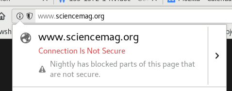

# HTTPS-checker

This repository checks scholarly publishers and preprint archives for their HTTP(S) status. Upon initial full version it will be ported to the [Liberate Science](https://github.com/libscie) organization account.

## The risk

When websites are HTTP, they do not encrypt the traffic. That way, anyway who gets in between can change content (a Man In The Middle; or MITM) without the user realizing. On the flipside, any content the user inputs (say: passwords) are unsecured and can be eavesdropped by anyone. BOOOOO! 😠



## The progress

HTTPS anno 2018 is still the minority of webpages. Old webpages need to be upgraded, and new ones need to get certificates (I know, I was a sysadmin for some pages that had HTTP way too long!). Initiatives like [CertBot]() and [Let's Encrypt]() make HTTPS more readily available.

There is no longer an excuse for websites that attract substantial traffic, require users to input information (any kind), and depend on content integrity to not be HTTPS without clear reasons why.

Scholarly publishers need to have all of these --- they need to have HTTPS is the idea. But we cannot hold them accountable or recognize their valiant efforts to upgrade to HTTPS if we don't monitor it. That's what this project is about.

## The process

1. Collect data about active publisher's use of HTTPS
2. Identify the largest publishers without HTTPS to contact
3. Track how they respond.
4. Provide a visual interface to the data
5. Extend the audit with more detailed security indicators, such as 

### Dependencies

Please ensure to have the following dependencies installed:

```bash
# curl https://bootstrap.pypa.io/get-pip.py -o get-pip.py
# sudo python3 get-pip.py

# https://github.com/dhs-ncats/pshtt
pip install pshtt --user
```

## Code of conduct

This project is released with a [Contributor Code of Conduct](CODE_OF_CONDUCT.md). By participating in this project you agree to abide by its terms. We welcome you with open arms if you are mindful and respectful of differences. You might not always understand another person's perspective; acknowledging that other people's feelings or perspectives are valid regardless of your understanding is prerequisite number one to being both mindful and respectful. We will not consider contributions if they are not done in a respectful manner, no matter how "genius" they might be.
